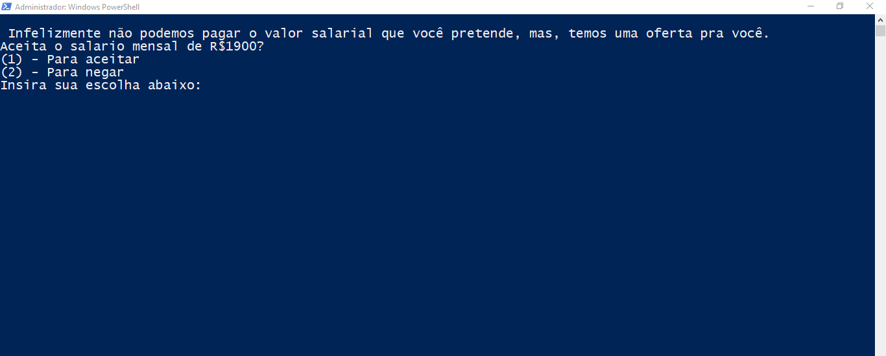
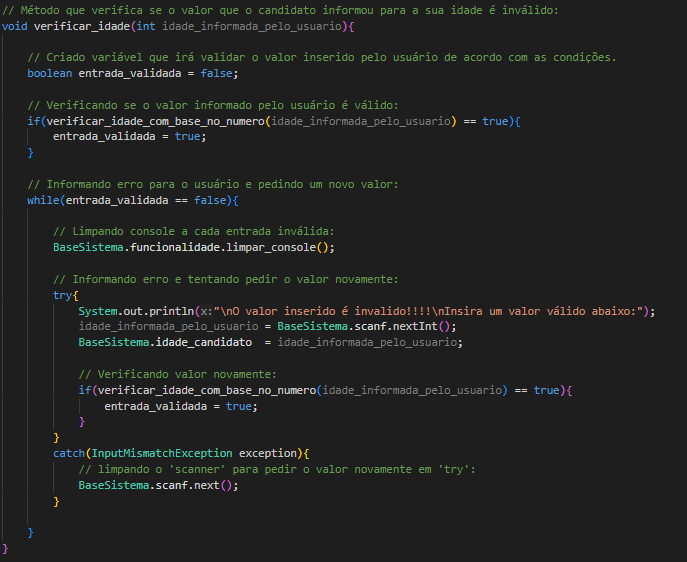
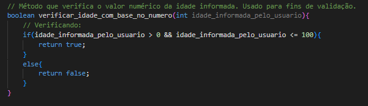

# Sistema de Processo Seletivo em Java

## Execute em sua máquina:

### Estes são os passos para você executar este sistema em sua máquina:

1. Primeiramente você precisa ter uma JRE instalada em sua maquina.

2. É importante ter a variável de ambiente ``JAVA_HOME`` configurada em seu sistema operacional, para garantir que a execução funcione. Você pode ver como fazer isso acessando este link, [clique aqui](https://www.alura.com.br/artigos/configurar-variaveis-ambiente-windows-linux-macos?utm_term=&utm_campaign=%5BSearch%5D+%5BPerformance%5D+-+Dynamic+Search+Ads+-+Artigos+e+Conte%C3%BAdos&utm_source=adwords&utm_medium=ppc&hsa_acc=7964138385&hsa_cam=11384329873&hsa_grp=111087461203&hsa_ad=699128146778&hsa_src=g&hsa_tgt=dsa-2276348409543&hsa_kw=&hsa_mt=&hsa_net=adwords&hsa_ver=3&gad_source=1&gclid=Cj0KCQjwxqayBhDFARIsAANWRnTzYppbCT9tcLTm5Tf9eqgY-sB17JnPwh_HtDHI8ctyf5nyB9dhPE8aAtuREALw_wcB).

3. Clone o repositório em sua máquina. Primeiramente, é nescessário que você tenha alguma versão do GIT em sua máquina. Para fazer a clonagem. vá até a pasta do seu sistema onde você quer colocar o projeto usando: ``cd + caminho`` em seu terminal. Exemplo: `` cd /c/programacao/projetos_clonados``. Após estar na pasta, use o comando: ``` git clone https://github.com/luisfl04/processo_seletivo-java.git ``` , para clonar o repositório.   

4. Após clonado, navegue até a pasta ``bin`` do projeto. Exemplo: ``` cd projeto_seletivo-java/bin ```. Ao estar na pasta bin, use este comando para executar o programa: ``` java proj.lf04.processo_seletivo.face.ProcessoSeletivo ```. Após estes passos, o sistema deve ser executado.
---
## Screenshot do sistema:


## Descrição do funcionamento do sistema:

### Descrição geral:

> O fluxo de execução em relação ao usuário é bem simples. São lhe pedidas algumas entradas de dados, como: nome, idade e seu salário pretendido. O dado que rege a execução do sistema, é o de 'salário pretendido', pois a partir deste valor o sistema vai proseguir em fluxo correspondente. Foram implementados 3 fluxos, um para quando o salário pretendido pelo candidato é maior que o salário base da empresa, outro para quando os valores dos salários são iguais, e um último para quando o valor de salário pretendido pelo candidato é menor que o salário base. É importante ressaltar que este sistema não foi implementado pensando muito na interação com o usuário, sua implementação está mais voltada para o tratamento dos dados que o usuário informa, tentando resolver todos os casos possíveis neste contexto.

## Métodos de tratamento dos dados inseridos:


> Todos os métodos os método de validação de dados estão na classe ``VerificacaoDados``, no arquivo ``BaseSistema.java``. Basicamente, todos estes método ultilizam de um método do tipo ``Boolean`` para auxiliar na sua execução. O método auxiliar está voltado para a verificação em relação ao *valor* da variável, já o método principal fica responsável pelo controle de validação, ou seja, por verificar se o valor inserido é incorreto e fazer o pedido da entrada deste valor até que o usuário digite um valor válido. Este é um exemplo de método auxiliar que auxilia o método ``verificar_idade()``(Que foi exibido acima):


---

>Como visto, a finalidade deste método está relacionada apenas ao valor do parâmetro. Neste caso, só é aceito de idades entre 1 e 100 anos, nos outros métodos, como os de verificação de salário pretendido e verificação do telefone que o usuário inseriu, são feitas verificações de acordo com os valores permitidos, que mudam de método para método. Enfim, peço que quem esteja lendo fique a vontade para dar uma olhada nestas implementações, e se encontrar melhorias ou idéias, pode ficar a vontade para abrir uma *issue*.

## Tecnologias usadas:


## Minhas redes sociais:
[](https://www.instagram.com/luisfl04_/) 
[](mailto:luisfelipecontato08@gmail.com)


